# Jarkom-Modul-1-2026-K-14

|No|Nama Anggota|NRP|
|---|---|---|
|1|Muhammad Satrio Utomo|5027251022
|2|Sebastian Elroi Hasian Panjaitan|5027251040|

## Pengerjaan
### Soal 1 - Satrio
> Untuk mempersiapkan pembangunan The Wired, Lain yang berperan sebagai Router membuat tiga Switch/Gateway: Switch 1 menuju dua Entitas yaitu Alice dan Mika, Switch 2 menuju Chisa, sedangkan Switch 3 menuju Knights dan Eiri. Kelima Entitas tersebut dikonfigurasi sebagai Client di GNS3.

Membuat topologi dengan 1 router, 3 switch, dan 5 entitas. dengan entitas Alice dan Mika ke switch 1, entitas Chisa ke switch 2, dan entitas Knigth dan Eiri ke switch 3.
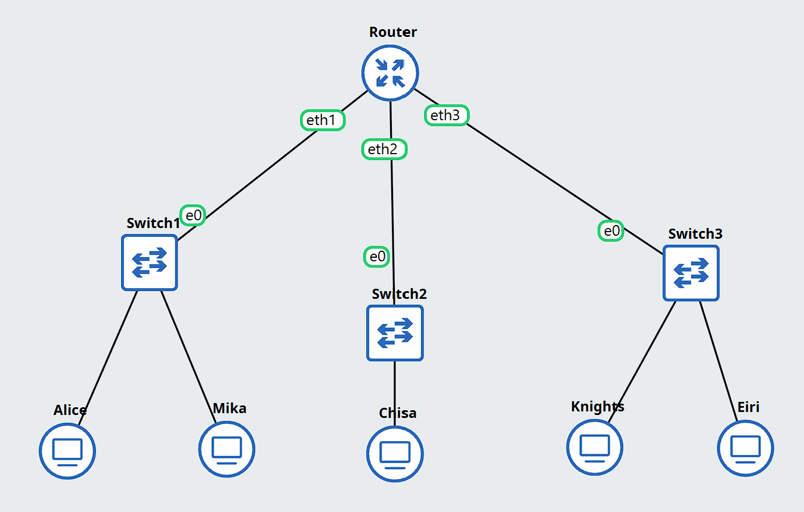

Mengonfigurasikan router dengan:
```
auto eth1
iface eth1 inet static
   address 192.218.1.1
   netmask 255.255.255.0

auto eth2
iface eth2 inet static
   address 192.218.2.1
   netmask 255.255.255.0

auto eth3
iface eth3 inet static
   address 192.218.3.1
   netmask 255.255.255.0
```

Mengonfigurasikan entitas endpointnya dengan: (sebagai contoh entitas Alice)
```
auto eth0
iface eth0 inet static
   address 192.218.1.2
   netmask 255.255.255.0
   gateway 192.218.1.1
```

Pembuktian tiap entitas bisa tersambung ke router:
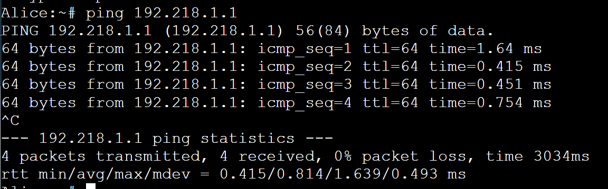

### Soal 2 - Satrio
> Karena menurut Lain pada saat itu The Wired masih terisolasi dari dunia luar, konfigurasikan router Lain agar dapat tersambung langsung ke jaringan internet publik melalui NAT/DHCP pada interface eth0.

Menambahkan node NAT, dan disambungkan ke router:
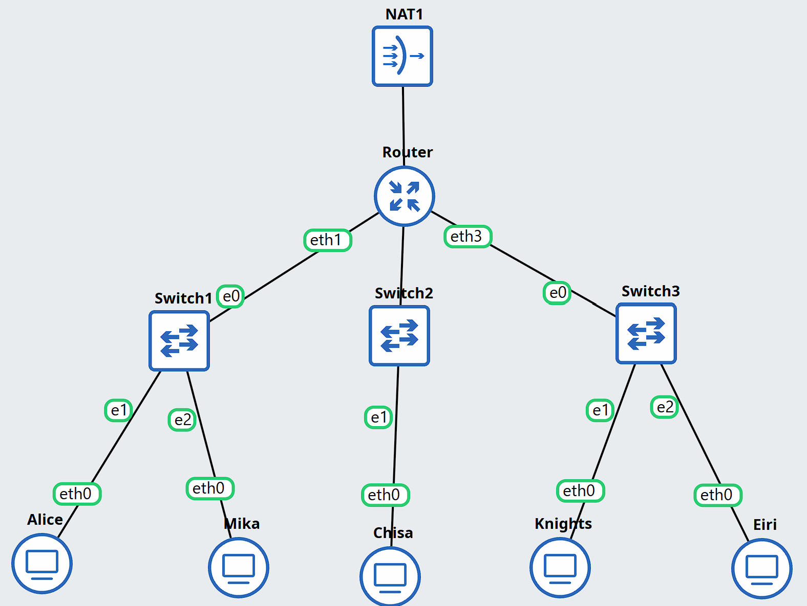

Untuk mengecek apakah router berhasil nyambung ke internet dengan menggunakan `ping 8.8.8.8`:
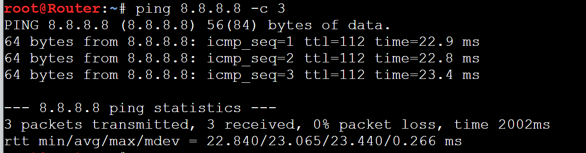

### Soal 3 - Satrio
>Setelah router Lain terhubung ke internet, pastikan seluruh Entitas (Client) di bawah Switch 1, Switch 2, dan Switch 3 dapat saling terhubung dan berkomunikasi satu sama lain melalui konfigurasi routing.

Dengan membuat script bernama `init.sh` di dalam router:
```
sysctl -w net.ipv4.ip_forward=1
```

Tes jika entity Alice bisa ping entity lain:
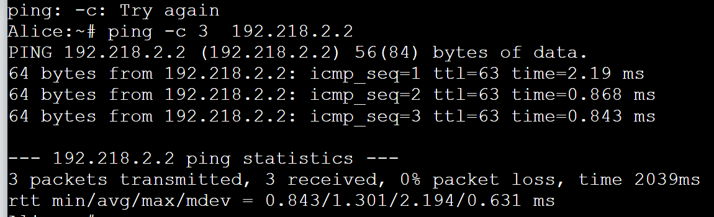

### Soal 4 - Satrio
>Lain ingin agar setiap Entitas (Client) memiliki kemandirian di The Wired. Konfigurasikan firewall/iptables (NAT Masquerade) dan DNS resolver agar setiap Client dapat terhubung ke internet secara mandiri (dapat melakukan ping ke 8.8.8.8 dan membuka domain web google.com).

Untuk menghubungkan ke internet bisa diselesaikan dengan mengetikkan `iptables -t nat -A POSTROUTING -o eth0 -j MASQUERADE -s [Prefix IP].0.0/16` pada router. dengan kasus ini prefix IP = `192.218.0.0/16`:
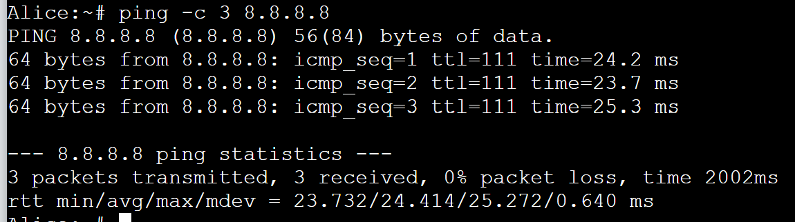

Dan untuk menghubungkan ke domain web, mengetik `echo nameserver 8.8.8.8 > /etc/resolv.conf` ke Entity.
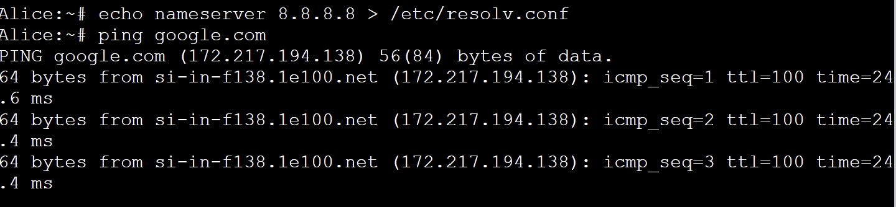

Agar memudahkan mensetup ulang, kami membuat file `init.sh` di dalam router untuk semua konfigurasinya:
```
#!/bin/bash

sysctl -w net.ipv4.ip_forward=1

iptables -t nat -A POSTROUTING -o eth0 -s 192.218.0.0/16 -j MASQUERADE
```

### Soal 5 - Satrio
>Eiri tetap berupaya menanamkan kekacauan ke dalam jaringan. Untuk mengantisipasi restart tiba-tiba, pastikan seluruh konfigurasi jaringan tidak hilang saat semua node di-restart. Buat script verifikasi di /root/cek_status.sh pada router Lain yang menampilkan ringkasan interface (ip -br a) dan status tabel NAT (iptables -t nat -L -v -n) setelah reboot.

Untuk mengerjakan soal ini, tinggal membuat file di dalam router dengan nama `cek_status.sh` yang berisi:
```
#!/bin/bash

ip -br a

iptables -t nat -L -v -n
```
setelah dijalankan akan memberi output seperti berikut:
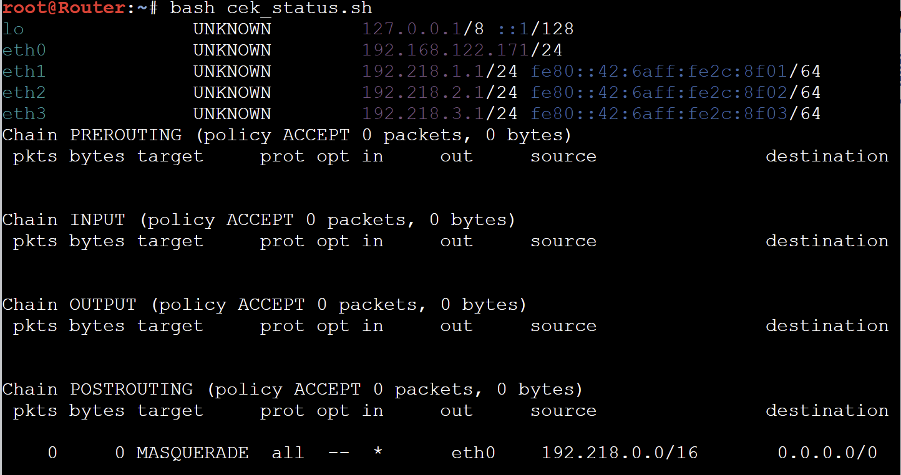

### Soal 6 - Satrio
>Mika mencurigai adanya anomali traffic pada segmen jaringannya. Jalankan generator traffic berikut (link file) pada node Mika, lalu lakukan packet sniffing menggunakan Wireshark pada interface node Mika. Terapkan display filter khusus untuk menyaring paket yang berprotokol DNS atau ICMP. Tunjukkan screenshot hasil filter beserta ringkasan paket yang lolos.

Langkah pertama adalah mendownload link file ke dalam console MIka, tapi disini saya menggunakan copy-paste manual dari source codenya.
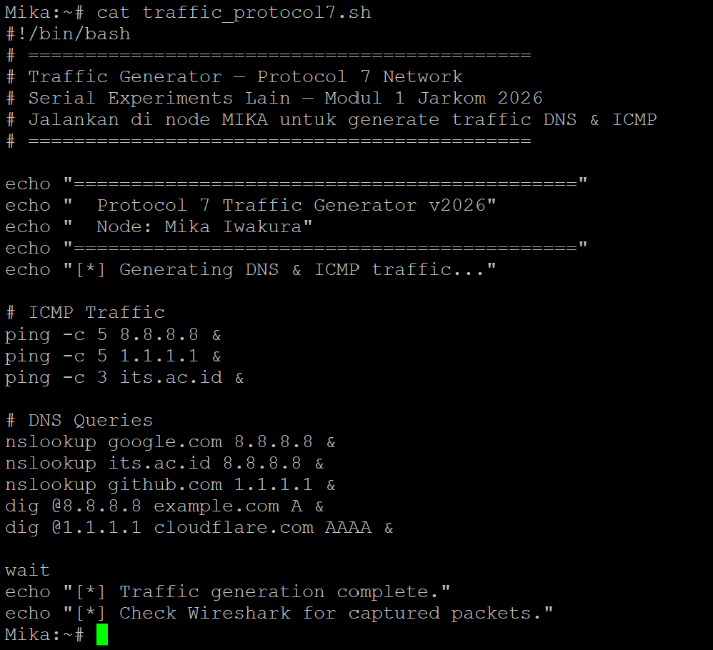

Untuk melakukan packet sniffing, menginspect kabel antara node Mika dengan Switch 1, lalu start capture. maka wireshark akan terbuka, dan ketika menjalankan `traffic_protocol7.sh` maka akan muncul data di wireshark.
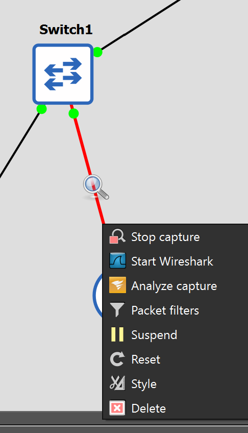

Hasil data capture oleh wireshark sebelum disaring:
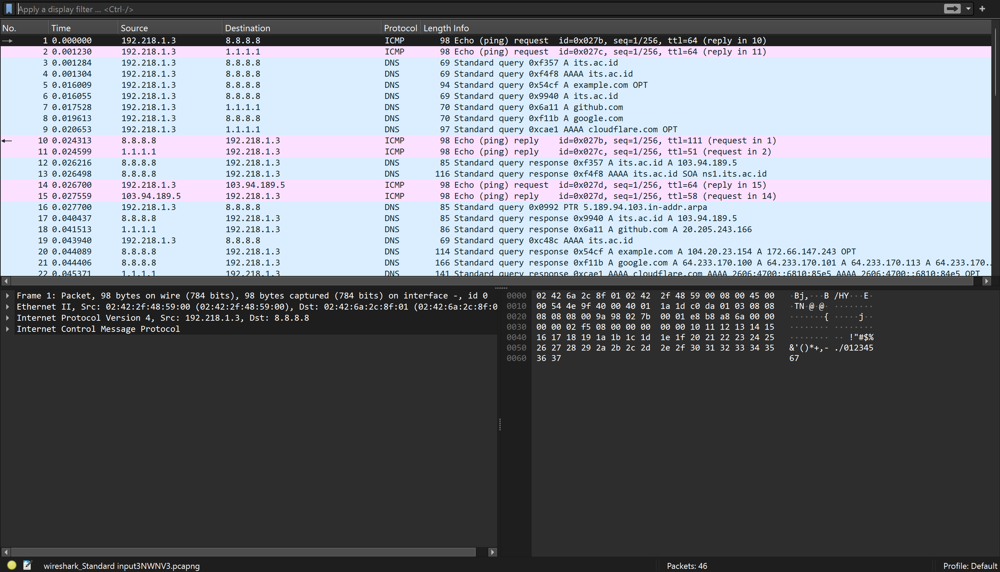

Hasil data capture setelah melakukan display filter untuk protokol paket DNS atau ICMP:
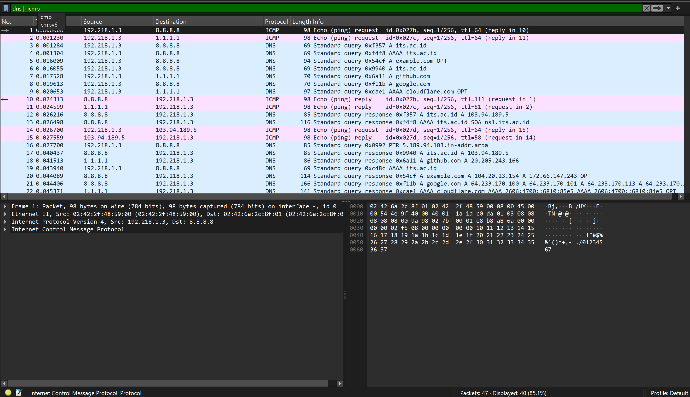

Setelah filter diterapkan, dari total 47 paket yang ditangkap, terdapat  paket yang lolos filter. Paket yang lolos terdiri dari ICMP Echo Request/Reply (ping) dan paket Standard query DNS yang mencoba meminta resolusi nama domain tertentu.

### Soal 7 - Satrio
> Chisa memutuskan mendirikan FTP Server pada node miliknya dengan shared folder di /var/wired/data. Terapkan kebijakan akses: user alice (hak akses read & write), user mika (dibatasi read-only), dan user eiri (dibatasi tanpa izin akses / blacklist). Buktikan konfigurasi dengan membuat file signal_alice.txt dari user alice, dan buktikan penolakan akses saat user eiri mencoba login.

Membuat setup di node Chisa sebagai FTP server dan jalankan script ini:
```
cat << 'EOF' > /root/setup_ftp.sh
#!/bin/bash
apk update
apk add vsftpd

# Setup direktori dan user
mkdir -p /var/wired/data
adduser -D alice
echo "alice:alice" | chpasswd
adduser -D mika
echo "mika:mika" | chpasswd
adduser -D eiri
echo "eiri:eiri" | chpasswd

# Setup permission folder
chown alice:root /var/wired/data
chmod 755 /var/wired/data

# Konfigurasi vsftpd
cat << 'CONF' > /etc/vsftpd/vsftpd.conf
anonymous_enable=NO
local_enable=YES
write_enable=YES
local_umask=022
listen=YES
listen_ipv6=NO
local_root=/var/wired/data
userlist_enable=YES
userlist_deny=YES
userlist_file=/etc/vsftpd.userlist
seccomp_sandbox=NO
CONF

# Setup blacklist
echo "eiri" > /etc/vsftpd.userlist

# Restart layanan vsftpd
killall vsftpd 2>/dev/null
vsftpd /etc/vsftpd/vsftpd.conf &
EOF
```

Lalu, untuk mengeceknya, setiap node klien (Alice, Mika, dan Eiri) untuk setiap aksesnya. Sebelumnya mengubah dan menjalankan script `init.sh` di tiap node klien yang ditambahkan dengan:
```
apk update

apk add lftp
```
Selanjutnya, di setiap node, jalankan 
```
lftp -u [username],[username] 192.218.2.2
```
untuk masuk ke server FTP milik Chisa

Output akses Alice (Bisa melakukan read & write dibuktikan dengan keberhasilan upload file `signal_alice.txt` menggunakan perintah `put`):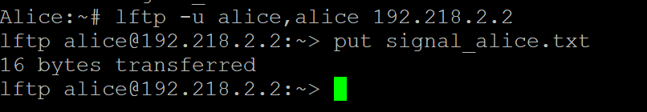
Output akses Mika (Bisa melakukan read dengan melihat isi folder lewat perintah `ls`, tapi tidak bisa write karena ditolak dengan kode error `553` saat mencoba `put`):
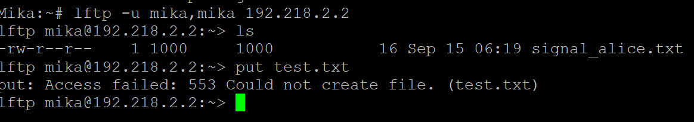
Output akses Eiri (Terkena blacklist, sehingga login langsung ditolak oleh sistem dengan kode error `530 Permission denied`):
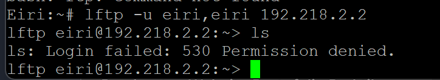

### Soal 8 - Satrio
>Kelompok rahasia Knights perlu mengirimkan dokumen laporan intelijen ke FTP Server Chisa. Lakukan koneksi FTP client dari node Knights ke FTP Server Chisa menggunakan akun alice. Upload file berikut (link file). Analisis sesi Wireshark dan sebutkan: perintah FTP untuk upload (STOR), kode status sukses server (226), dan port data TCP yang dinegosiasikan pada mode PASV.

Masuk ke console Knights, dan masukkan script lftp yang sama dengan node client lain. lalu mulai gunakan wireshark dan capture jaringan antara node Knights dengan Switch 3. dan melakukan display filter untuk hanya menampilkan paket FTP aja.

Dari node Knights, mencoba masuk ke server ftp menggunakan akun Alice.
```
lftp -u alice,alice 192.218.2.2
```
setelah berhasil login, mencoba mengirim file `knights_report.txt` sebagai dokumen rahasia dengan menggunakan `put`:
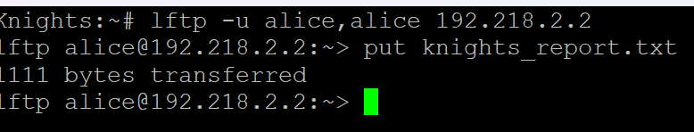

#### Analisis 
1. Port data TCP pada mode PASV:

Sebelum mengirim data file, klien meminta server untuk memasuki mode pasif dengan mengirimkan flag `PASV`. Server menyetujuinya dan membalas dengan `227 Entering Passive Mode (192,218,2,2,152,51)..`
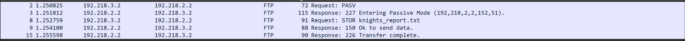 <br>
Respons ini memberikan informasi IP server dan port acak yang dibukanya untuk menerima data. Port data TCP dihitung dari dua angka terakhir (205 dan 86) dengan menggunakan perhitungan berikut:
$Port = (x \times 256) + y$ <br>
$Port = (152 \times 256) + 51$ <br>
$Port = 38963$ <br>
Dengan demikian, negosiasi berhasil dan transfer data dilakukan melalui jalur TCP port 38963.

2. Perintah Upload FTP (STOR):

Setelah jalur koneksi data terbuka, klien (Knights) menginstruksikan server untuk bersiap menyimpan file dengan mengirimkan perintah `STOR knights_report.txt`. Perintah `STOR` (Store) ini adalah terjemahan dari perintah dasar `put` yang dieksekusi oleh pengguna. <br>


3. Kode Status Sukses Server (226):

Server Chisa memberikan izin aliran data dengan pesan `150 Ok to send data`. Setelah isi dari dokumen `secret.txt` selesai ditransfer seluruhnya melalui port pasif, server mengonfirmasi penyelesaian tugas tersebut dengan mengirimkan kode status `226 Transfer complete..` Kode ini adalah indikator final bahwa server telah menutup koneksi data karena proses unggah file sukses 100% tanpa ada paket yang corrupt.  


### Soal 9 - Satrio
> Mika mengakses dokumen Protokol Tujuh di (link file) dari FTP Server Chisa. Dari node Mika, unduh file tersebut menggunakan akun mika. Setelah itu, buktikan pembatasan read-only dengan mencoba mengunggah file baru dari akun mika, dan tunjukkan pesan error respon server (error 550 Permission denied) saat mika mencoba melakukan upload.

Untuk memulai, pada console Chisa (server FTP) harus diupload terlebih dahulu file `protocol7_manifesto.txt` dan memastikan file tersebut bisa dibaca oleh client lain dengan menggunakan:
```
chmod 755 /var/wired/data/protocol7_manifesto.txt
```
chmod 755 berfungsi untuk memberikan izin baca dan execute untuk grup atau user lain.

Lalu dari node Mika, mencoba mendownload file `protocol7_manifesto.txt` yang ada di FTP server, dan mencoba untuk mengunggah file `test.txt` yang nantinya akan ditolak oleh server karena Mika tidak punya izin untuk WRITE.
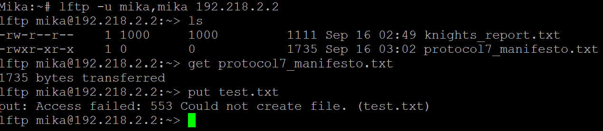

### Soal 10 - Satrio
> Knights melancarkan uji ketahanan koneksi ke server Chisa untuk menguji latensi jaringan The Wired. Kirimkan paket ping dari node Knights ke node Chisa dengan payload khusus 128 bytes dan interval 0.3 detik sebanyak 77 paket (ping -c 77 -s 128 -i 0.3 <IP_Chisa>). Buka Wireshark, catat nilai ICMP Type dan Code untuk Echo Request vs Echo Reply, serta analisis packet loss dan RTT (min/avg/max).

Sebelum melakukan `ping`, harus disiapkan dulu capture untuk node Knights ke Router3 dan start capture untuk membuka wireshark.

Lalu pada console Knights, mengeksekusi perintah:
```
ping -c 77 -s 128 -i 0.3 192.218.2.2
```
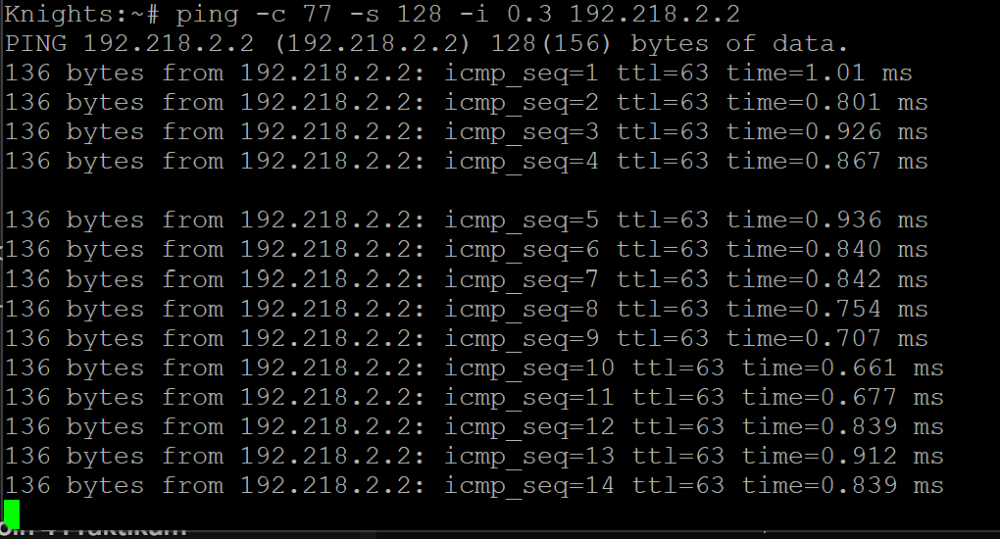
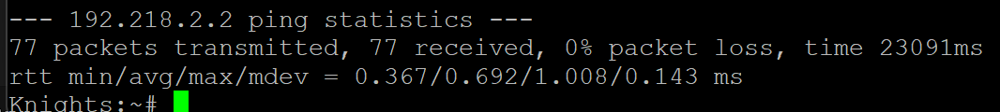

#### Analisis Packet Loss dan RTT
Berdasarkan ringkasan statistik dari terminal saat perintah ping selesai dieksekusi, didapatkan hasil sebagai berikut:

Packet Loss: Dari total 77 paket yang dikirimkan (transmitted), 77 paket berhasil diterima (received) oleh server. Hal ini menghasilkan 0% packet loss, yang menunjukkan bahwa koneksi jaringan The Wired sangat stabil dan tidak ada paket yang drop di tengah jalan.

RTT (min/avg/max): Waktu tempuh bolak-balik paket (latensi) tercatat sangat baik. Nilai latensi terendah (min) adalah 0.367 ms, rata-rata latensi (avg) berada di angka 0.692 ms, dan latensi tertingginya (max) hanya menyentuh 1.008 ms.

#### Analisis Wireshark
Hasil melakukan Wireshark:
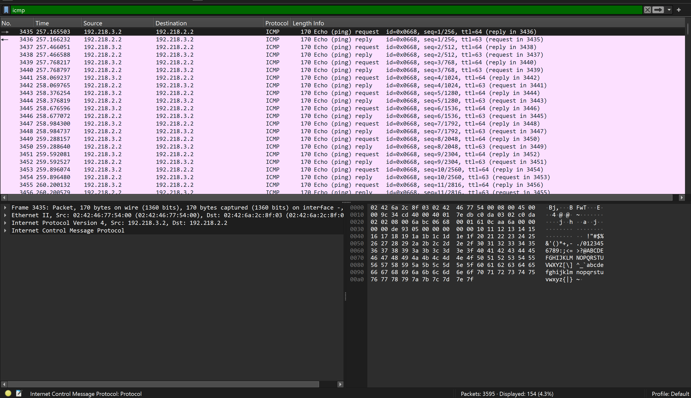

Melalui pengamatan detail paket pada Wireshark dengan filter icmp, tercatat interaksi request-reply yang merepresentasikan perintah ping tersebut.<br>
Berdasarkan header Internet Control Message Protocol, terdapat dua jenis pesan utama: <br>
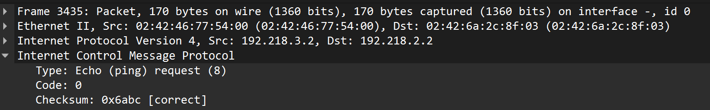 <br>
Echo Request (Knights $\rightarrow$ Chisa): Paket yang berisi permintaan dari klien ini membawa nilai Type: 8 dan Code: 0. <br>
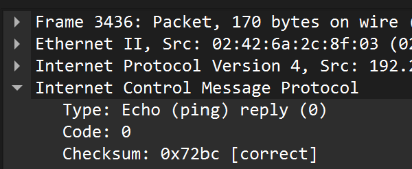
Echo Reply (Chisa $\rightarrow$ Knights): Paket balasan dari server merespons dengan nilai Type: 0 dan Code: 0.<br>

### Soal 11 - Satrio
> Buktikan kelemahan protokol Telnet dengan membuat akun phantom_user dan password wired_ghost pada layanan telnetd di node Chisa. Lakukan login Telnet dari node Eiri ke node Chisa dan tangkap sesi menggunakan Wireshark. Tunjukkan kredensial plain text melalui fitur Follow TCP Stream, serta jelaskan mengapa setiap karakter terkirim dalam paket TCP terpisah.

Menyiapkan dahulu akun `phantom_user` dengan script yang saya tulis di file `setup_telnet.sh` dan dieksekusi:
```
#!/bin/bash
apk update
apk add busybox-extras

=adduser -D phantom_user 2>/dev/null

echo "phantom_user:wired_ghost" | chpasswd

killall telnetd 2>/dev/null
telnetd

echo "Telnet Server sudah menyala dan siap menerima koneksi!"
```
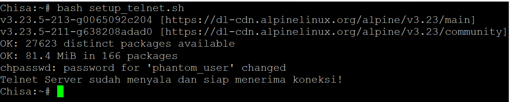

Setelah itu, mulai capturing dari Node Eiri ke switch3.

Dari node Eiri, melakukan perintah:
```
telnet 192.218.2.2
```
Untuk menyambungkan ke server, dan masukkan login dengan user `phantom_user` dengan password `wired_ghost`:
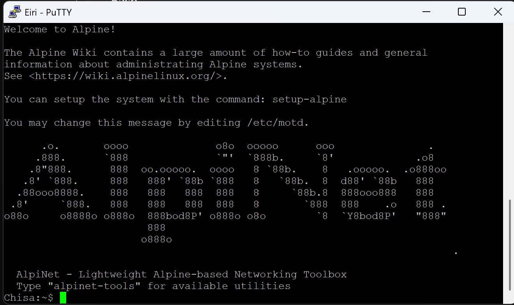

Setelah itu melakukan analisis di wireshark dengan memilih salah satu package telnet yang terekam lalu `right click`, pilih `follow` $\rightarrow$ `TCP Stream`. Disana terdapat informasi login dan password yang tidak terenkripsi sama sekali (berupa plain text):
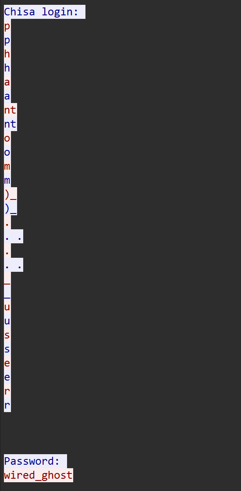

### Soal 12 - Satrio
>Alice mencurigai Knights menjalankan beberapa layanan rahasia di node-nya. Lakukan pemindaian port dari node Alice ke node Knights menggunakan Netcat (nc) untuk memeriksa port 22 (SSH) dan 80 (HTTP) dalam keadaan terbuka, serta port rahasia 7777 dalam keadaan tertutup. Analisis di Wireshark perbedaan TCP Flag yang dikembalikan antara port terbuka (SYN-ACK) dengan port tertutup (RST-ACK).

Setup start capture dari node Alice, lalu menambahkan filter pada wireshark `tcp.port == 22 || tcp.port == 80 || tcp.port == 7777`.
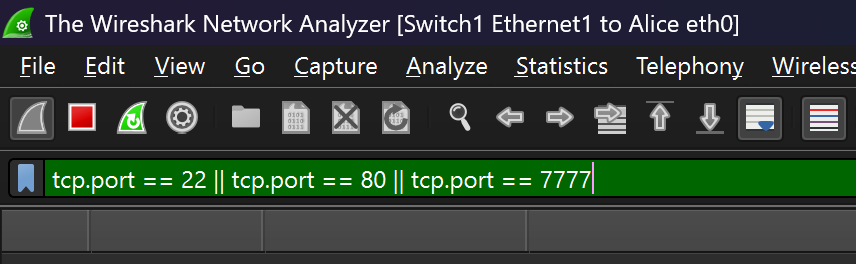

Lalu pada console knight, menyalakan SSH service pada port 22 dan HTTP pada port 80. dengan menggunakan srcipt `setup_ssh.sh`:
```
#!/bin/bash

apk update
apk add openssh busybox-extras
ssh-keygen -A
/usr/sbin/sshd
httpd -p 80
```
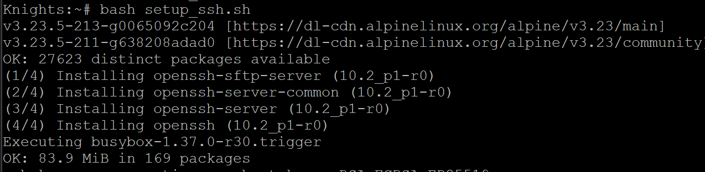

Setelah itu, pindah ke console Alice. menggunakan `nc` dengan parameter `-vz` untuk mengecek status port dari node Knights.
- Pindai SSH : `nc -vz 192.218.3.2 22`
- Pindai HTTP : `nc -vz 192.218.3.2 80`
- Pindai Secret Port : `nc -vz 192.218.3.2 7777`

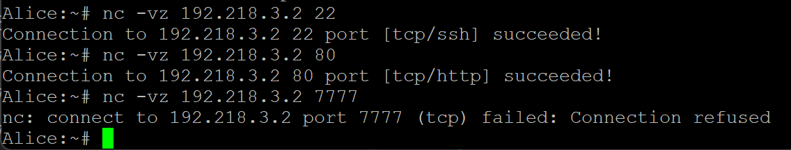

Disini udah benar, dengan keterangan port 22 dan 80 terbuka sedangkan port 7777 tertutup. Lalu melakukan analisis di wiresark khusus pada port 7777, buka bagian `Transmission Control Protocol` dan akan menemukan flag bernilai `0x014`

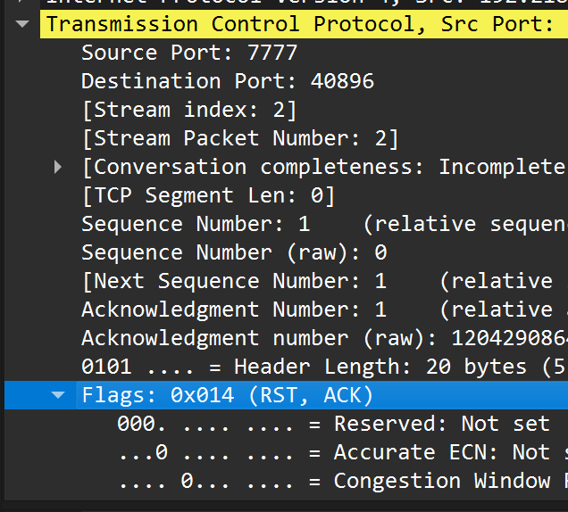

### Soal 13 - Satrio
> Lain memerintahkan agar administrasi jarak jauh menggunakan SSH secara aman tanpa password. Install OpenSSH server pada node Knights, buat pasangan kunci SSH (ssh-keygen) pada node Mika untuk user mika_admin, dan konfigurasikan public key authentication (PasswordAuthentication no). Lakukan koneksi SSH dari node Mika ke node Knights, tangkap sesi menggunakan Wireshark, identifikasi paket Protocol Version Exchange dan Key Exchange, serta jelaskan mengapa kredensial tidak terlihat dalam bentuk teks terbuka seperti pada Telnet.

Menginstall SSH di node Knights, membuat user `mika_admin` dengan password sementara, menyalakan servicenya. dengan menggunakan:
```
#!/bin/bash

apk update
apk add openssh

adduser -D mika_admin
echo "mika_admin:rahasia" | chpasswd

ssh-keygen -A
/usr/sbin/sshd
```

Lalu pindah ke node Mika, membuat user yang sama, generate kuncinya, lalu kirim public keynya ke Knights:
```
apk update
apk add openssh
```
```
adduser -D mika_admin
su - mika_admin
```
```
ssh-keygen -t rsa
```
```
ssh-copy-id mika_admin@192.218.3.2
```

Lalu kembali ke node Knights, Karena kunci sudah ditransfer,  mematikan fitur login pakai password agar hanya yang punya kunci (Mika) yang bisa masuk.
```
echo "PasswordAuthentication no" >> /etc/ssh/sshd_config

killall sshd
/usr/sbin/sshd
```

Start capture pada jalur node Mika. lalu melakukan filter `ssh`
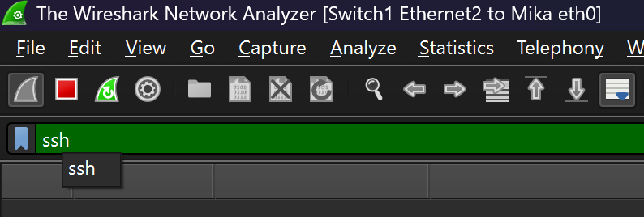

Kembali ke node Mika dan pastikan masi login dengan akun `mika_admin`. lalu mengoneksikan ssh ke knights:
```
ssh mika_admin@192.218.3.2
```

Dan berhasil masuk ke akun Knights dalam console Mika tanpa password.
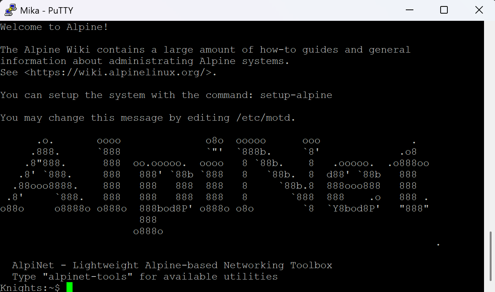

Hasil dari capture wireshark:
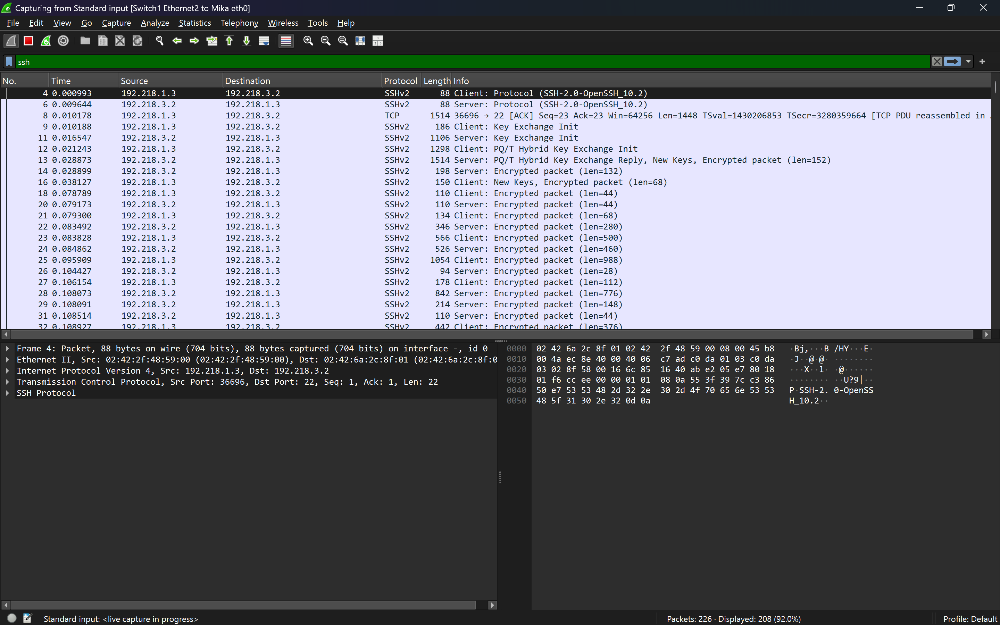

Buka hasil dari paket yang bernama `Client: Protocol` dan menemukan protocol SSH-2.0-OpenSSH_10.2:
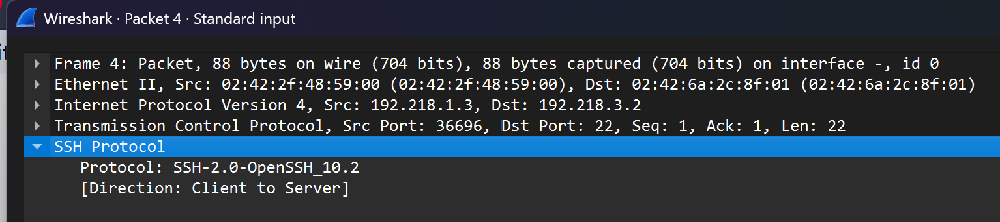

Lalu, buka `Client: Key Exchange Init` dan akan menemukan algoritma enkripsi yang digunakan
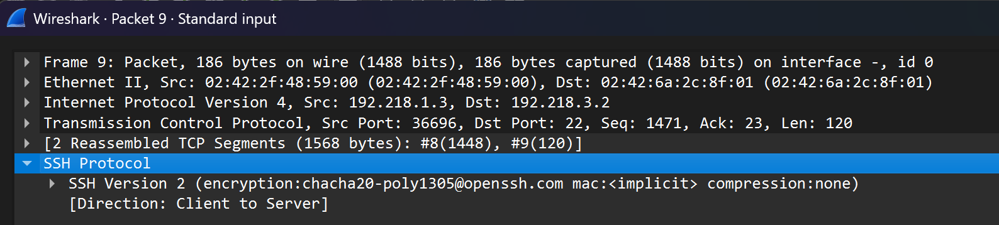

Mengapa kredensial tidak terlihat seperti Telnet?
Setelah proses Key Exchange selesai, klien dan server sepakat membuat sebuah "Kunci Sesi" (Session Key). Mulai titik itu, seluruh komunikasi selanjutnya dibungkus dan diacak menggunakan kriptografi yang kuat. Proses Mika memberikan Public Key-nya untuk otentikasi terjadi di dalam lorong yang sudah terenkripsi tersebut. Di Wireshark, ini hanya akan terlihat sebagai paket bertuliskan `Encrypted packet`, sehingga password atau kunci tidak akan pernah bocor sebagai plain text.

### Soal 14 - Bastian
> Setelah gagal mengakses FTP, Eiri melancarkan serangan brute-force terhadap form login web Alice. Analisis file capture `wired_bruteforce.pcapng` untuk mengidentifikasi alamat IP penyerang, target IP beserta port yang diserang, password user `lain_admin` yang berhasil ditembus, serta web server software dan versi yang dilaporkan pada response header.

**Penemuan dan Analisis:**
Analisis dilakukan dengan menggunakan Wireshark untuk menelusuri aktivitas *brute-force* yang terekam pada lalu lintas jaringan.
*   **Sebelum filter:** Menampilkan seluruh *traffic* yang tertangkap oleh sistem.
    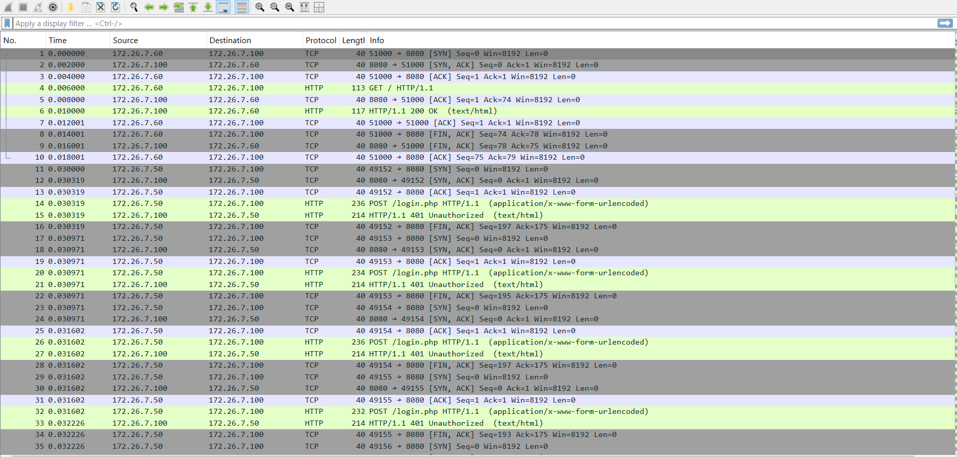
*   **Setelah filter:** Dengan menerapkan *display filter* khusus protokol HTTP, terlihat jelas bahwa seluruh upaya akses tidak sah (*Unauthorized*) berasal dari satu alamat IP, yaitu **172.26.7.50**, yang berulang kali mengincar alamat IP target **172.26.7.100**.
    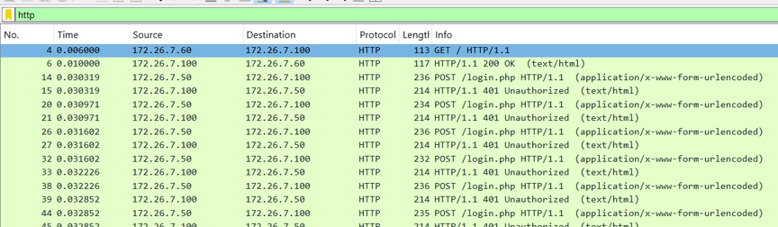
*   Berdasarkan penelusuran pada *HTTP Response*, target layanan yang diserang beroperasi pada **Port 8080**. Web server yang digunakan oleh mesin target (Alice) teridentifikasi dari *response header* sebagai **Apache/2.4.62**.
    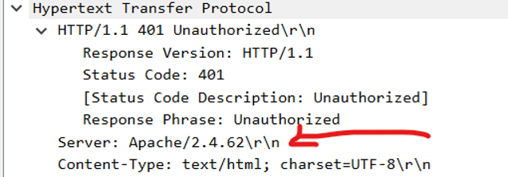
*   Melalui inspeksi *payload* pada bagian *HTML Form URL Encoded*, terungkap bahwa penyerang mencoba meretas akun dengan *username* `lain_admin`. *Password* yang akhirnya berhasil menembus autentikasi adalah **`wired_pr0tocol_7`**.
    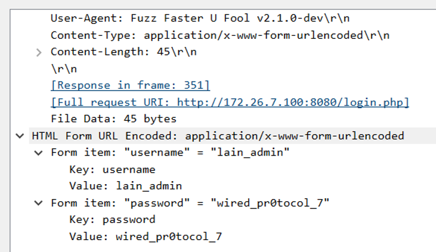

**Verifikasi Socket Server:**
Berdasarkan temuan di atas, validasi pada *socket server* berhasil dan menghasilkan bendera (*flag*) berikut:
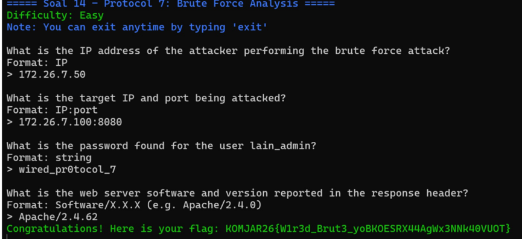

**Flag:** `KOMJAR26{W1r3d_Brut3_yoBKOESRX44AgWx3NNk40VUOT}`

---

### Soal 15 - Bastian
> Eiri menyusup ke ruang server dan memasang perangkat keyboard USB berbahaya pada node Alice. Buka file capture `wired_usb_hid.pcap`, identifikasi Vendor ID dan Product ID perangkat USB dari deskriptor USB, alamat nomor device USB, serta pesan rahasia yang berhasil dicuri dari keystroke.

**Penemuan dan Analisis:**
*   Awal pembukaan *file capture* menunjukkan interaksi protokol USB secara keseluruhan pada saat perangkat dicolokkan.
    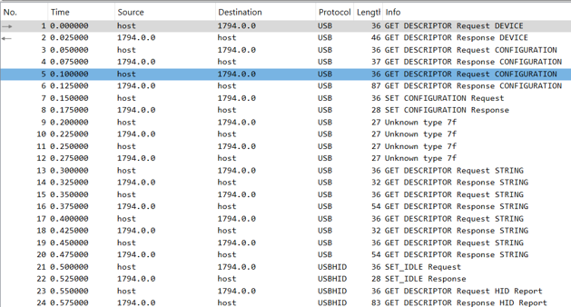
*   Dengan mengaplikasikan filter `usb.idVendor && usb.idProduct`, *Device Descriptor* dari perangkat USB berbahaya tersebut dapat diidentifikasi secara spesifik.
    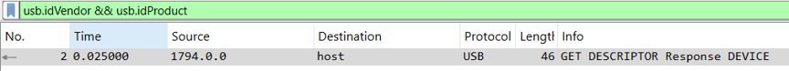
*   Berdasarkan deskriptor tersebut, perangkat memiliki **Vendor ID:** `0x046d` (Logitech, Inc.) dan **Product ID:** `0xc31c` (Keyboard K120).
    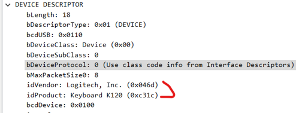
*   Pada fase inisiasi awal (*enumeration*), perangkat tersebut terbaca menggunakan **Device Address 0** secara sementara.
    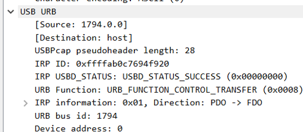
*   Namun, saat perangkat mulai secara aktif mengirimkan data *keystroke* berbahaya ke komputer, alamat perangkat yang ditugaskan (*assigned*) dan terekam pada log adalah **Device Address 7**.
    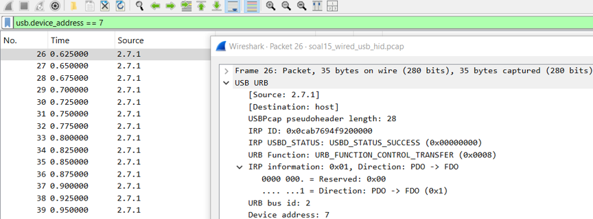
*   Kumpulan *hex scan codes* dari *keystroke* yang dicuri adalah: `1a 00 0c 00 15 00 08 00 07 00 2d 00 13 00 15 00 12 00 17 00 12 00 06 00 12 00 0f 00 2d 00 24 00 2d 00 0c 00 16 00 2d 00 04 00 0f 00 0c 00 19 00 08 00 2d 00 1f 00 27 00 1f 00 23 00`. Setelah dikonversi menjadi teks ASCII, pesan rahasia tersebut berbunyi: **`wired-protocol-7-is-alive-2026`**.

**Verifikasi Socket Server:**
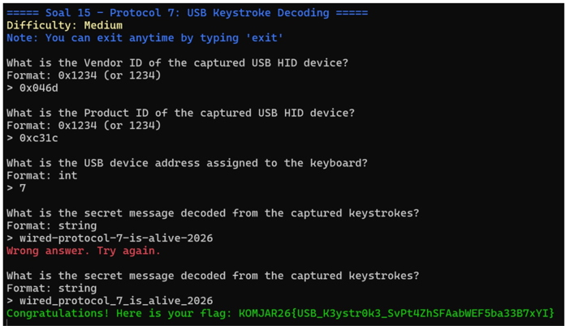

**Flag:** `KOMJAR26{USB_K3ystr0k3_SvPt4ZhSFAabWEF5ba33B7xYI}`

---

### Soal 16 - FTP Credential Theft
> Eiri meletakkan file malware di server. Dari file capture `wired_ftp_theft.pcap`, lakukan analisis lalu lintas FTP untuk mengidentifikasi alamat IP server FTP penyerang, banner software FTP yang digunakan, kredensial login penyerang, serta ukuran (size in bytes) dari file malware `knights_payload.exe` yang diunduh.

**Penemuan dan Analisis:**
*   Melalui penyaringan aktivitas FTP, diidentifikasi bahwa server FTP penyerang yang mendistribusikan *malware* beroperasi pada alamat IP **198.51.100.7**.
    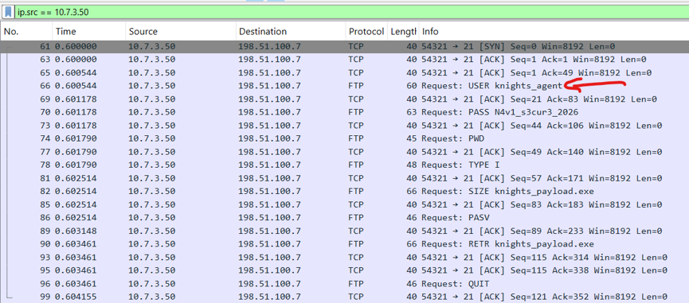
*   Berdasarkan balasan *header* saat koneksi FTP diinisiasi, *software banner* yang digunakan oleh server penyerang secara eksplisit tertulis sebagai **`vsftpd 3.0.5`**.
    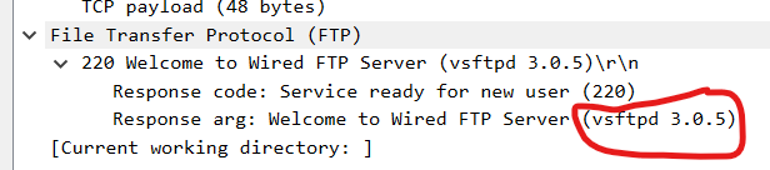
*   Dari rekaman lalu lintas jaringan yang tidak terenkripsi, kredensial yang digunakan oleh penyerang untuk melakukan otentikasi adalah *username* **`knights_agent`** dan *password* **`N4v1_s3cur3_2026`**.
    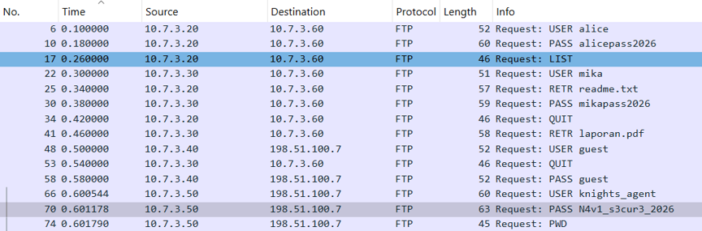
*   Penyerang mengunduh *file malware* bernama `knights_payload.exe`. Dari negosiasi perintah data biner, server menginformasikan bahwa ukuran pasti *file* tersebut adalah **524288 bytes**.
    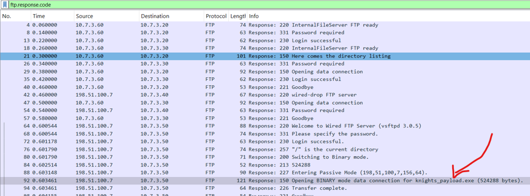

**Verifikasi Socket Server:**
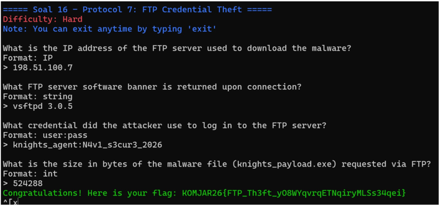

**Flag:** `KOMJAR26{FTP_Th3ft_yO8WYqvrqETNqiryMLSs34qei}`

---

### Soal 17 - HTTP Malware Retrieval
> Alice membuat halaman web di node-nya. Eiri memanfaatkan celah untuk mengunduh payload berbahaya ke sistem Alice. Analisis file capture `wired_http_c2.pcap` untuk mengidentifikasi nama domain (Host) tempat malware diunduh, alamat IP server penyerang, nama file executable malware yang diunduh, serta kode status HTTP yang dikembalikan.

**Penemuan dan Analisis:**
*   Berdasarkan analisis pada *HTTP Request* yang terekam, diidentifikasi bahwa *file malware* diunduh dari sebuah nama domain (Host) mencurigakan, yakni **`wired-update.net`**.
    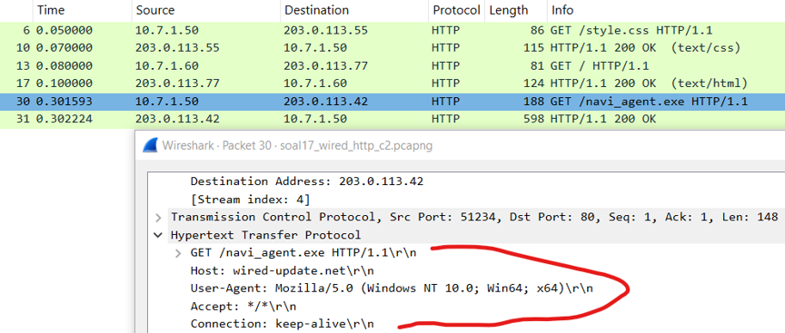
*   *File executable malware* yang ditarik oleh sistem korban dari domain tersebut bernama **`navi_agent.exe`**.
    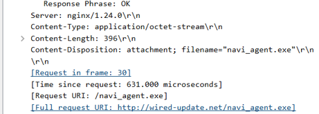
*   Aktivitas pengunduhan *malware* ini bersumber dari server *Command & Control* (C2) penyerang yang memiliki alamat IP **203.0.113.42**.
*   Server penyerang merespons permintaan unduhan tersebut dengan memberikan *HTTP Status Code* **200 (OK)**, yang menandakan bahwa pengiriman *payload* berbahaya telah berhasil diselesaikan secara utuh.
    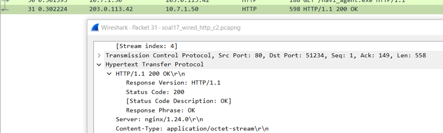

**Verifikasi Socket Server:**
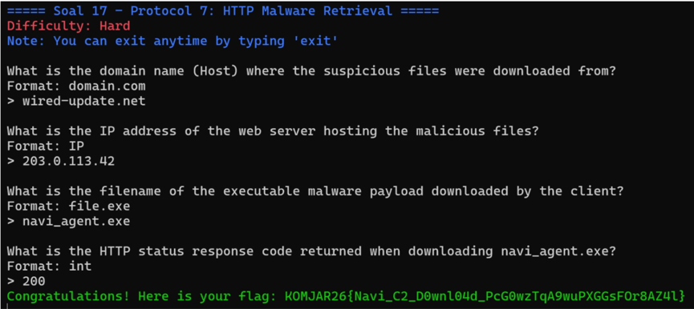

**Flag:** `KOMJAR26{Navi_C2_D0wnl04d_PcG0wzTqA9wuPXGGsFOr8AZ4l}`

---

### Soal 18 - SMB Lateral Transfer
> Eiri mengubah taktik penyerangan dengan menanamkan file malware menggunakan protokol file sharing SMB. Analisis file capture `wired_smb_transfer.pcapng` untuk mengidentifikasi nama protokol jaringan yang dieksploitasi, IP pengirim dan penerima, folder tujuan penyimpanan malware pada sistem korban, serta nama file executable malware yang ditransfer.

**Penemuan dan Analisis:**
Berdasarkan tinjauan detail pada paket jaringan `wired_smb_transfer.pcapng`, pergerakan lateral (*lateral movement*) berhasil diidentifikasi:
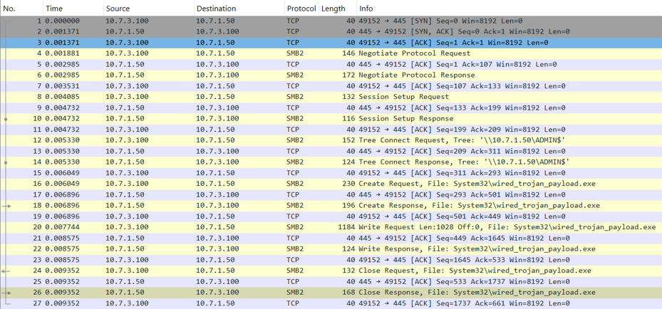

*   **Protokol Jaringan:** Penyerang mengeksploitasi protokol file sharing **SMB2** (hal ini terlihat jelas dari dominasi paket yang ditandai dengan perintah *Request* dan *Response* SMB2 pada Wireshark).
*   **IP Pengirim (Attacker):** Alamat IP penyerang yang menginisiasi *Create Request* dan mentransmisikan *malware* secara aktif adalah **10.7.3.100**.
*   **IP Penerima (Korban):** Server korban yang merespons paket (menerima proses penulisan *malware*) memiliki alamat IP **10.7.1.50**.
*   **Folder Tujuan:** *Malware* tersebut ditanamkan pada *path directory/share tree* jaringan administratif, tepatnya di **`\\10.7.1.50\ADMIN$`** pada sistem korban.
*   **Nama File Malware:** Berdasarkan paket data yang disisipkan, *file executable* berbahaya yang diselundupkan bernama **`wired_trojan_payload.exe`**.

**Verifikasi Socket Server:**
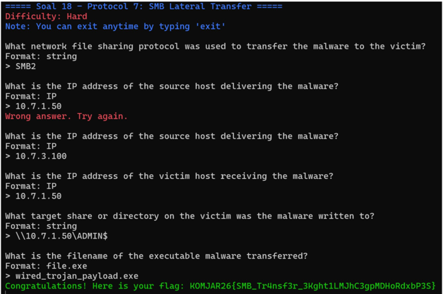

**Flag:** `KOMJAR26{SMB_Tr4nsf3r_3Kght1LMJhC3gpMDHoRdxbP3S}`

---

### Soal 19 - SMTP Threat Inspection
> Eiri meneror jaringan dengan mengirimkan email pemerasan melalui protokol SMTP tanpa enkripsi. Analisis file capture `wired_smtp_threat.pcap` pada stream TCP terkait, identifikasi alamat email korban yang ditargetkan, password korban yang diklaim bocor oleh penyerang, jenis malware yang diinfeksikan, batas waktu (dalam hari) yang diberikan, serta MailClientID yang tercantum pada pesan.

**Penemuan dan Analisis:**
Dengan menyimak aliran SMTP (*Follow TCP Stream*) dari file `wired_smtp_threat.pcap`, struktur komunikasi dan konten *email* pemerasan berhasil direkonstruksi sepenuhnya.
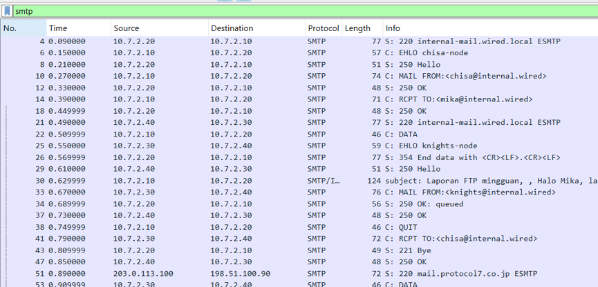

*   **Alamat Email Korban:** Berdasarkan *Internet Message Format* pada *header* "To:", surel ancaman tersebut ditujukan ke alamat **`victim@protocol7.co.jp`** (meskipun *routing* jaringan sempat melibatkan *node* internal `chisa@internal.wired` dan `mika@internal.wired`).
    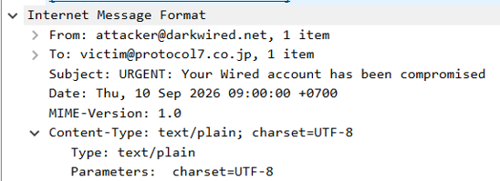
*   **Password yang Bocor:** Dalam isi teks surel (*Line-based text data*), penyerang secara eksplisit mengklaim telah mengantongi *password* milik korban, yaitu **`pr0tocol_7_user`**.
*   **Jenis Malware:** Penyerang menakut-nakuti korban dengan menyatakan telah menginfeksi sistem menggunakan *malware* jenis **`ransomware`**.
    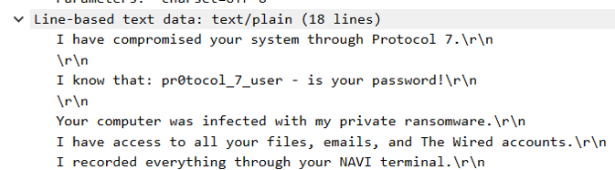
*   **Batas Waktu (Deadline):** Penyerang memberikan tenggat waktu yang ketat untuk pembayaran tebusan Bitcoin, yakni selama 72 jam atau **3** hari.
*   **MailClientID:** Pada baris paling akhir surel tersebut, terdapat penanda identifikasi pelacakan *MailClientID* yang bernilai **`7719980706`**.
    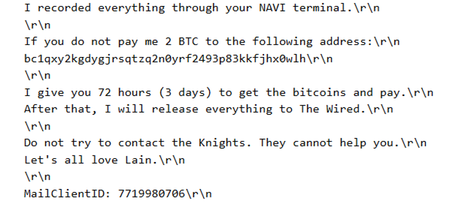

**Verifikasi Socket Server:**
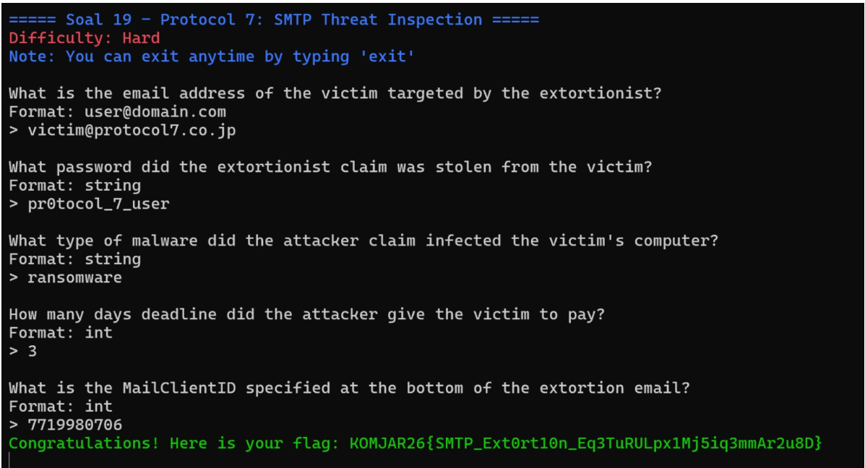

**Flag:** `KOMJAR26{SMTP_Ext0rt10n_Eq3TuRULpx1Mj5iq3mmAr2u8D}`

---

### Soal 20 - TLS Decrypted Stream
> Untuk rencana pamungkasnya, Eiri menyembunyikan komunikasi malware di balik saluran terenkripsi TLS. Namun Alice telah menyediakan file keylog untuk mendekripsi lalu lintas data tersebut. Analisis file capture `wired_tls_decrypt.pcapng` bersama `keyslogfile.txt` untuk mengidentifikasi versi protokol TLS yang dinegosiasikan, nama domain (SNI) yang diakses, alamat IP server HTTPS penyerang, User-Agent yang digunakan, serta HTTP request method dan path yang tersembunyi di dalam sesi dekripsi.

**Penemuan dan Analisis:**
Setelah mengintegrasikan *file keylog* ke dalam pengaturan protokol TLS di Wireshark, lapisan enkripsi terbuka sehingga muatan data asli (*Application Data*) berhasil dibongkar.
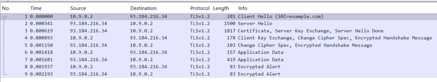

*   **Versi Protokol TLS:** Pertukaran pesan *Handshake* antara klien dan server menyepakati penggunaan protokol enkripsi **TLSv1.2**.
    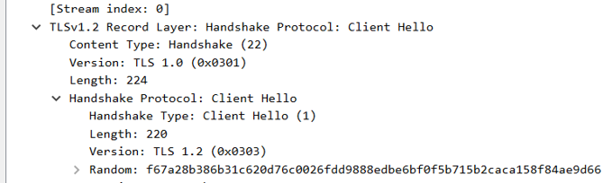
*   **Nama Domain (SNI):** Dari ekstensi `server_name` pada pesan *Client Hello*, diketahui bahwa klien secara spesifik memanggil domain **`example.com`**.
    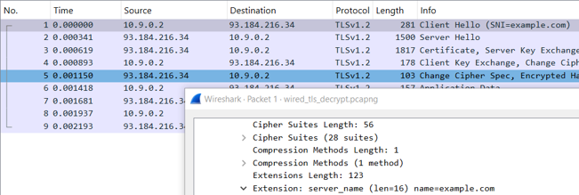
*   **IP Server HTTPS Penyerang:** Klien internal (IP `10.9.0.2`) membangun komunikasi dan mengirimkan kunci enkripsi ke *server* HTTPS eksternal yang beralamat IP **93.184.216.34**.
*   **User-Agent:** Dari sesi lalu lintas HTTP yang berhasil didekripsi, klien terbukti tidak menggunakan *browser* biasa, melainkan program berbasis *command line*, yakni dengan *User-Agent string* **`curl/7.62.0`**.
*   **HTTP Request Method & Path:** Di dalam saluran aman tersebut, terselip komunikasi tersembunyi yang melakukan pemanggilan ke server menggunakan metode HTTP **`HEAD`** menuju root direktori atau *path* **`/`** (diinterpretasikan utuh sebagai *HEAD / HTTP/1.1*).
    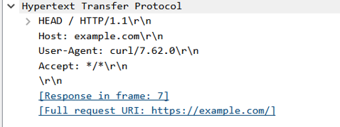
    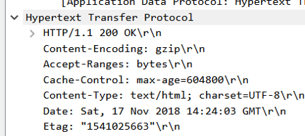

**Verifikasi Socket Server:**
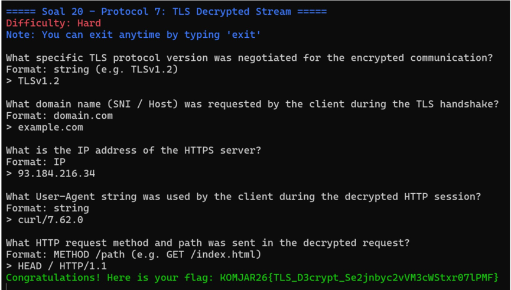

**Flag:** `KOMJAR26{TLS_D3crypt_Se2jnbyc2vVM3cWStxr07lPMF}`