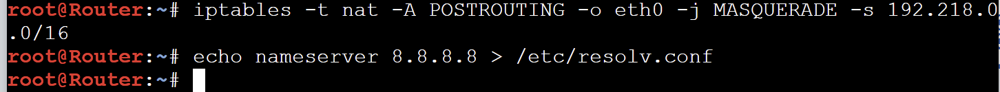

# Jarkom-Modul-1-2026-K-14

|No|Nama Anggota|NRP|
|---|---|---|
|1|Muhammad Satrio Utomo|5027251022
|2|Sebastian Elroi Hasian Panjaitan|5027251040|

## Pengerjaan
### Soal 1 - Satrio
> Untuk mempersiapkan pembangunan The Wired, Lain yang berperan sebagai Router membuat tiga Switch/Gateway: Switch 1 menuju dua Entitas yaitu Alice dan Mika, Switch 2 menuju Chisa, sedangkan Switch 3 menuju Knights dan Eiri. Kelima Entitas tersebut dikonfigurasi sebagai Client di GNS3.

Membuat topologi dengan 1 router, 3 switch, dan 5 entitas. dengan entitas Alice dan Mika ke switch 1, entitas Chisa ke switch 2, dan entitas Knigth dan Eiri ke switch 3.


Mengonfigurasikan router dengan:
```
auto eth1
iface eth1 inet static
   address 192.218.1.1
   netmask 255.255.255.0

auto eth2
iface eth2 inet static
   address 192.218.2.1
   netmask 255.255.255.0

auto eth3
iface eth3 inet static
   address 192.218.3.1
   netmask 255.255.255.0
```

Mengonfigurasikan entitas endpointnya dengan: (sebagai contoh entitas Alice)
```
auto eth0
iface eth0 inet static
   address 192.218.1.2
   netmask 255.255.255.0
   gateway 192.218.1.1
```

Pembuktian tiap entitas bisa tersambung ke router:


### Soal 2 - Satrio
> Karena menurut Lain pada saat itu The Wired masih terisolasi dari dunia luar, konfigurasikan router Lain agar dapat tersambung langsung ke jaringan internet publik melalui NAT/DHCP pada interface eth0.

Menambahkan node NAT, dan disambungkan ke router:


Untuk mengecek apakah router berhasil nyambung ke internet dengan menggunakan `ping 8.8.8.8`:


### Soal 3 - Satrio
>Setelah router Lain terhubung ke internet, pastikan seluruh Entitas (Client) di bawah Switch 1, Switch 2, dan Switch 3 dapat saling terhubung dan berkomunikasi satu sama lain melalui konfigurasi routing.

Dengan membuat script bernama `init.sh` di dalam router:
```
sysctl -w net.ipv4.ip_forward=1
```

Tes jika entity Alice bisa ping entity lain:


### Soal 4 - Satrio
>Lain ingin agar setiap Entitas (Client) memiliki kemandirian di The Wired. Konfigurasikan firewall/iptables (NAT Masquerade) dan DNS resolver agar setiap Client dapat terhubung ke internet secara mandiri (dapat melakukan ping ke 8.8.8.8 dan membuka domain web google.com).

Untuk menghubungkan ke internet bisa diselesaikan dengan mengetikkan `iptables -t nat -A POSTROUTING -o eth0 -j MASQUERADE -s [Prefix IP].0.0/16` pada router. dengan kasus ini prefix IP = `192.218.0.0/16`:


Dan untuk menghubungkan ke domain web, mengetik `echo nameserver 8.8.8.8 > /etc/resolv.conf` ke router.


Agar memudahkan mensetup ulang, kami membuat file `init.sh` untuk semua konfigurasinya.