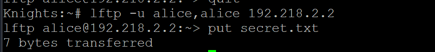

# Jarkom-Modul-1-2026-K-14

|No|Nama Anggota|NRP|
|---|---|---|
|1|Muhammad Satrio Utomo|5027251022
|2|Sebastian Elroi Hasian Panjaitan|5027251040|

## Pengerjaan
### Soal 1 - Satrio
> Untuk mempersiapkan pembangunan The Wired, Lain yang berperan sebagai Router membuat tiga Switch/Gateway: Switch 1 menuju dua Entitas yaitu Alice dan Mika, Switch 2 menuju Chisa, sedangkan Switch 3 menuju Knights dan Eiri. Kelima Entitas tersebut dikonfigurasi sebagai Client di GNS3.

Membuat topologi dengan 1 router, 3 switch, dan 5 entitas. dengan entitas Alice dan Mika ke switch 1, entitas Chisa ke switch 2, dan entitas Knigth dan Eiri ke switch 3.


Mengonfigurasikan router dengan:
```
auto eth1
iface eth1 inet static
   address 192.218.1.1
   netmask 255.255.255.0

auto eth2
iface eth2 inet static
   address 192.218.2.1
   netmask 255.255.255.0

auto eth3
iface eth3 inet static
   address 192.218.3.1
   netmask 255.255.255.0
```

Mengonfigurasikan entitas endpointnya dengan: (sebagai contoh entitas Alice)
```
auto eth0
iface eth0 inet static
   address 192.218.1.2
   netmask 255.255.255.0
   gateway 192.218.1.1
```

Pembuktian tiap entitas bisa tersambung ke router:


### Soal 2 - Satrio
> Karena menurut Lain pada saat itu The Wired masih terisolasi dari dunia luar, konfigurasikan router Lain agar dapat tersambung langsung ke jaringan internet publik melalui NAT/DHCP pada interface eth0.

Menambahkan node NAT, dan disambungkan ke router:


Untuk mengecek apakah router berhasil nyambung ke internet dengan menggunakan `ping 8.8.8.8`:


### Soal 3 - Satrio
>Setelah router Lain terhubung ke internet, pastikan seluruh Entitas (Client) di bawah Switch 1, Switch 2, dan Switch 3 dapat saling terhubung dan berkomunikasi satu sama lain melalui konfigurasi routing.

Dengan membuat script bernama `init.sh` di dalam router:
```
sysctl -w net.ipv4.ip_forward=1
```

Tes jika entity Alice bisa ping entity lain:


### Soal 4 - Satrio
>Lain ingin agar setiap Entitas (Client) memiliki kemandirian di The Wired. Konfigurasikan firewall/iptables (NAT Masquerade) dan DNS resolver agar setiap Client dapat terhubung ke internet secara mandiri (dapat melakukan ping ke 8.8.8.8 dan membuka domain web google.com).

Untuk menghubungkan ke internet bisa diselesaikan dengan mengetikkan `iptables -t nat -A POSTROUTING -o eth0 -j MASQUERADE -s [Prefix IP].0.0/16` pada router. dengan kasus ini prefix IP = `192.218.0.0/16`:


Dan untuk menghubungkan ke domain web, mengetik `echo nameserver 8.8.8.8 > /etc/resolv.conf` ke Entity.


Agar memudahkan mensetup ulang, kami membuat file `init.sh` di dalam router untuk semua konfigurasinya:
```
#!/bin/bash

sysctl -w net.ipv4.ip_forward=1

iptables -t nat -A POSTROUTING -o eth0 -s 192.218.0.0/16 -j MASQUERADE
```

### Soal 5 - Satrio
>Eiri tetap berupaya menanamkan kekacauan ke dalam jaringan. Untuk mengantisipasi restart tiba-tiba, pastikan seluruh konfigurasi jaringan tidak hilang saat semua node di-restart. Buat script verifikasi di /root/cek_status.sh pada router Lain yang menampilkan ringkasan interface (ip -br a) dan status tabel NAT (iptables -t nat -L -v -n) setelah reboot.

Untuk mengerjakan soal ini, tinggal membuat file di dalam router dengan nama `cek_status.sh` yang berisi:
```
#!/bin/bash

ip -br a

iptables -t nat -L -v -n
```
setelah dijalankan akan memberi output seperti berikut:


### Soal 6 - Satrio
>Mika mencurigai adanya anomali traffic pada segmen jaringannya. Jalankan generator traffic berikut (link file) pada node Mika, lalu lakukan packet sniffing menggunakan Wireshark pada interface node Mika. Terapkan display filter khusus untuk menyaring paket yang berprotokol DNS atau ICMP. Tunjukkan screenshot hasil filter beserta ringkasan paket yang lolos.

Langkah pertama adalah mendownload link file ke dalam console MIka, tapi disini saya menggunakan copy-paste manual dari source codenya.


Untuk melakukan packet sniffing, menginspect kabel antara node Mika dengan Switch 1, lalu start capture. maka wireshark akan terbuka, dan ketika menjalankan `traffic_protocol7.sh` maka akan muncul data di wireshark.


Hasil data capture oleh wireshark sebelum disaring:


Hasil data capture setelah melakukan display filter untuk protokol paket DNS atau ICMP:


Setelah filter diterapkan, dari total 47 paket yang ditangkap, terdapat  paket yang lolos filter. Paket yang lolos terdiri dari ICMP Echo Request/Reply (ping) dan paket Standard query DNS yang mencoba meminta resolusi nama domain tertentu.

### Soal 7 - Satrio
> Chisa memutuskan mendirikan FTP Server pada node miliknya dengan shared folder di /var/wired/data. Terapkan kebijakan akses: user alice (hak akses read & write), user mika (dibatasi read-only), dan user eiri (dibatasi tanpa izin akses / blacklist). Buktikan konfigurasi dengan membuat file signal_alice.txt dari user alice, dan buktikan penolakan akses saat user eiri mencoba login.

Membuat setup di node Chisa sebagai FTP server dan jalankan script ini:
```
cat << 'EOF' > /root/setup_ftp.sh
#!/bin/bash
apk update
apk add vsftpd

# Setup direktori dan user
mkdir -p /var/wired/data
adduser -D alice
echo "alice:alice" | chpasswd
adduser -D mika
echo "mika:mika" | chpasswd
adduser -D eiri
echo "eiri:eiri" | chpasswd

# Setup permission folder
chown alice:root /var/wired/data
chmod 755 /var/wired/data

# Konfigurasi vsftpd
cat << 'CONF' > /etc/vsftpd/vsftpd.conf
anonymous_enable=NO
local_enable=YES
write_enable=YES
local_umask=022
listen=YES
listen_ipv6=NO
local_root=/var/wired/data
userlist_enable=YES
userlist_deny=YES
userlist_file=/etc/vsftpd.userlist
seccomp_sandbox=NO
CONF

# Setup blacklist
echo "eiri" > /etc/vsftpd.userlist

# Restart layanan vsftpd
killall vsftpd 2>/dev/null
vsftpd /etc/vsftpd/vsftpd.conf &
EOF
```

Lalu, untuk mengeceknya, setiap node klien (Alice, Mika, dan Eiri) untuk setiap aksesnya. Sebelumnya mengubah dan menjalankan script `init.sh` di tiap node klien yang ditambahkan dengan:
```
apk update

apk add lftp
```
Selanjutnya, di setiap node, jalankan 
```
lftp -u [username],[username] 192.218.2.2
```
untuk masuk ke server FTP milik Chisa

Output akses Alice (Bisa melakukan read & write dibuktikan dengan keberhasilan upload file `signal_alice.txt` menggunakan perintah `put`):
Output akses Mika (Bisa melakukan read dengan melihat isi folder lewat perintah `ls`, tapi tidak bisa write karena ditolak dengan kode error `553` saat mencoba `put`):

Output akses Eiri (Terkena blacklist, sehingga login langsung ditolak oleh sistem dengan kode error `530 Permission denied`):


### Soal 8 - Satrio
>Kelompok rahasia Knights perlu mengirimkan dokumen laporan intelijen ke FTP Server Chisa. Lakukan koneksi FTP client dari node Knights ke FTP Server Chisa menggunakan akun alice. Upload file berikut (link file). Analisis sesi Wireshark dan sebutkan: perintah FTP untuk upload (STOR), kode status sukses server (226), dan port data TCP yang dinegosiasikan pada mode PASV.

Masuk ke console Knights, dan masukkan script lftp yang sama dengan node client lain. lalu mulai gunakan wireshark dan capture jaringan antara node Knights dengan Switch 3. dan melakukan display filter untuk hanya menampilkan paket FTP aja.

Dari node Knights, mencoba masuk ke server ftp menggunakan akun Alice.
```
lftp -u alice,alice 192.218.2.2
```
setelah berhasil login, mencoba mengirim file `secret.txt` sebagai dokumen rahasia dengan menggunakan `put`:
